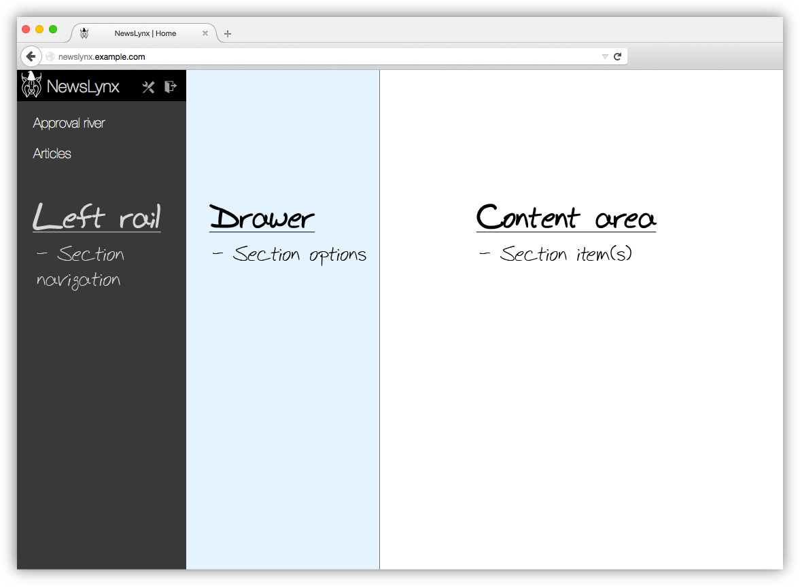
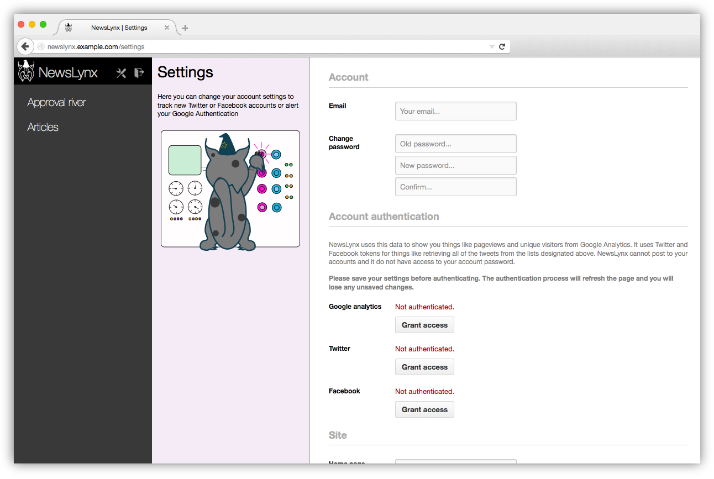
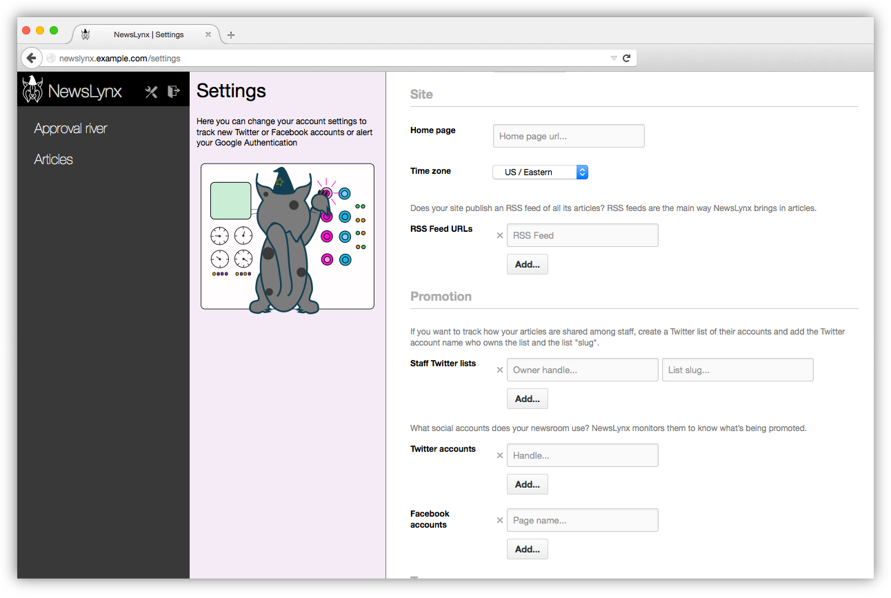
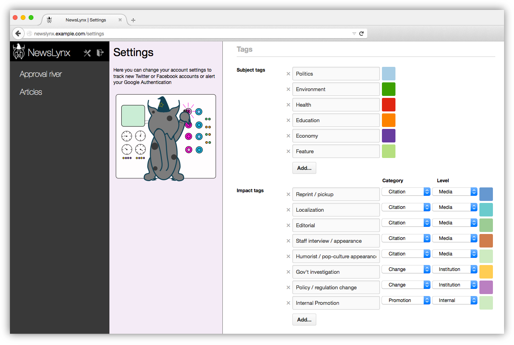
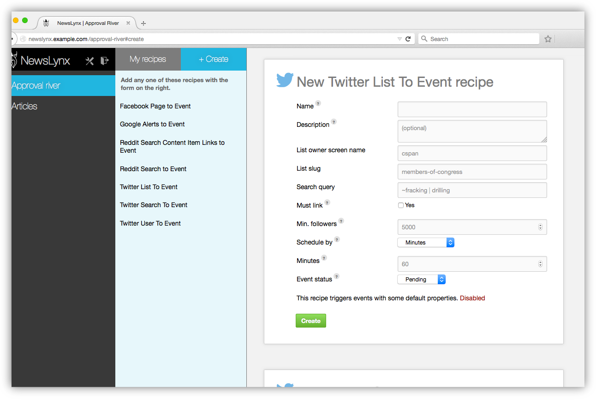
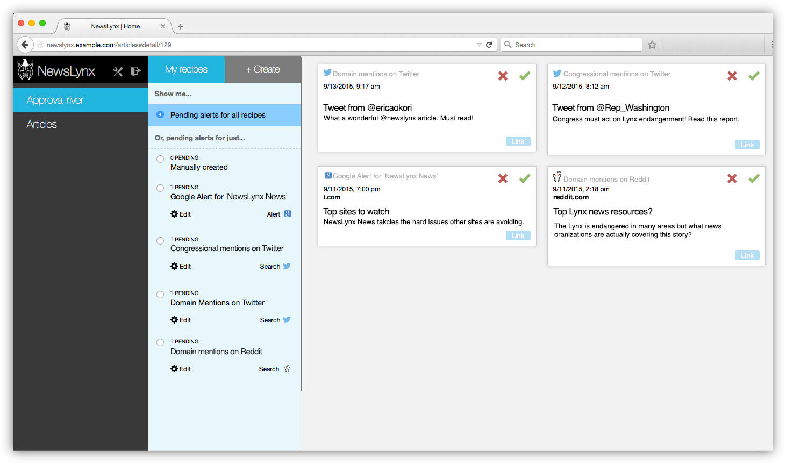
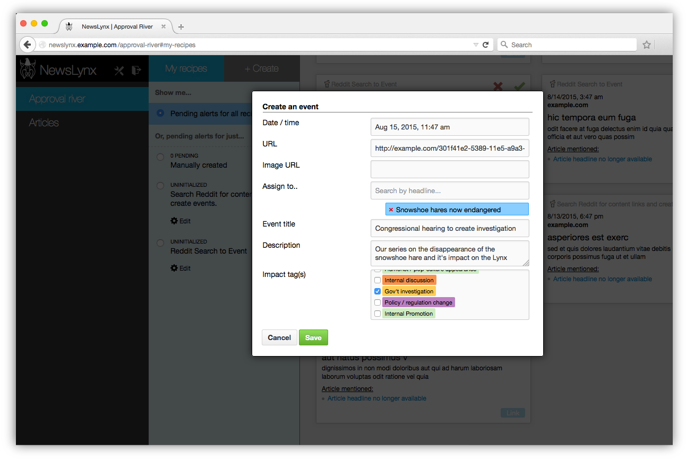
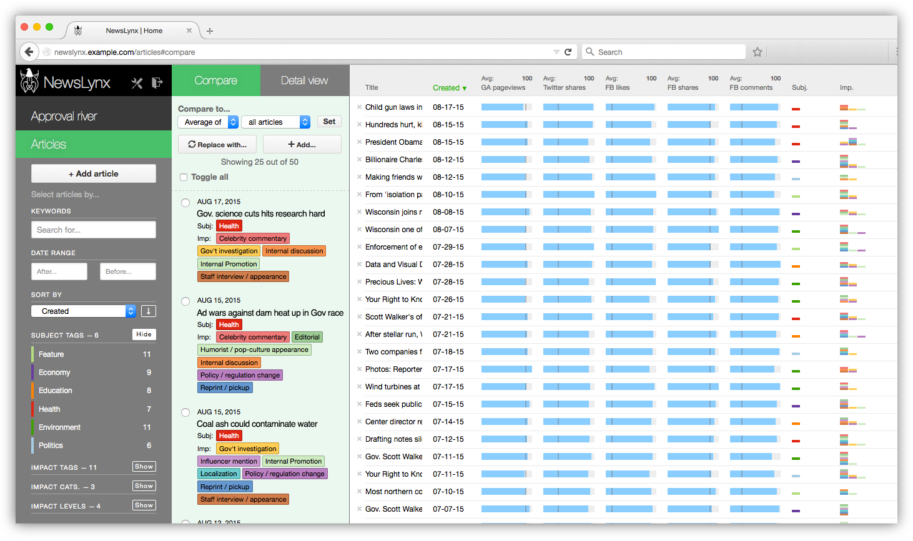
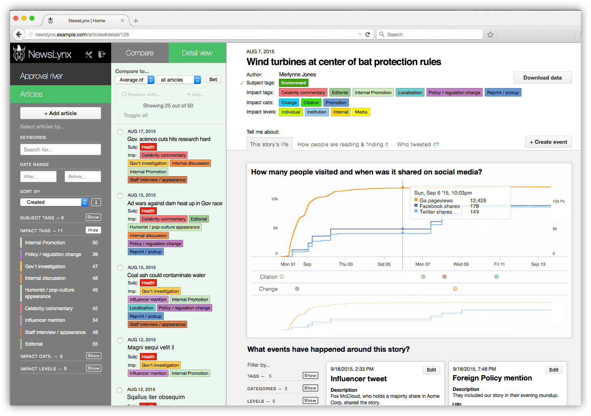

Welcome to NewsLynx!
=====================

I'm Merlynne Jones, the Chief Impcat Officer\* around here and I'll be showing you the ropes. I had the team write more technical documentation over [here](http://newslynx.readthedocs.org) if you want to dive into the depths of the machine.

NewsLynx is divided into three main pages: **Settings**, the **Approval River** and your **Articles**. There are also a few key concepts we'll go discuss along the way: **Tags**, **Recipes**, **Sous Chefs** and **Metrics**. We'll walk through the main pages and discuss these concepts and features as we go!

*\* Merlynne is a special breed of magical lynx, known as an "impcat" skilled at measuring impact.*

## A brief aside on site layout

The NewsLynx interface is divided into the three main areas from left to right: 

 * **Left rail** — Main section navigation, settings and logout links. Also sometimes helps you filter and select what items appear in the drawer.
 * **Drawer** — Section options or elements.
 * **Content area** — Main content items or item lists.

## Settings

I know what you're thinking: "Settings are boring!" They might not be as delectable to sink your teeth into as a tasty squirrel or snowshoe hare on a cold winter's hunt, but they're the foundation for getting the most out of NewsLynx! To access them, click on the "tools" symbol at the top of the **left rail**.

### User information

In NewsLynx, you have **organizations** and **users**. Every user must belong to at least one organization and can belong to multiple. If the latter is the case, the user will be prompted on login which organization they wish to view. 

On this page, the user can change their email and password, if they like.

### Authenticating

Before you can use the platform, you'll need to authenticate with Google Analytics, Twitter and Facebook. When you click "Grant access" you'll be prompted to login with the credentials for that platform. Here's what NewsLynx does with each of the data sources

* **Google Analytics** — For every article in the system, fetches analytics such as pageviews, device breakdown etc.
* **Twitter** — Fetches your API tokens so that NewsLynx can gather share counts without being rate limited.
* **Facebook** — Fetches your API tokens as well.

*Note: Neither Facebook or Twitter authentications ask or obtain privileges to post to your accounts.*

### Site

NewsLynx asks for the following basic bits of info about your site

* **Home page** — Used for various internal elements to know what your website is.
* **Time zone** — To make sure we're displaying information correctly
* **RSS Feed(s)** — This one is important. NewsLynx ingests articles based fully from one or many RSS Feeds that notify the world of your content being published. If you don't already have a comprehensive RSS Feed (or a few that when combined are comprehensive), you'll need to create one.

### Promotion

One of the novel things NewsLynx does is it keeps track of how much you're promoting an article through home page placement, posting to official Facebook or Twitter accounts or staff Twitter accounts. If you have multiple accounts for each category, click the "Add" button to create another input row.

### Tags

#### Subject matter tags

NewsLynx lets you organize your articles with subject matter tags. For instance, let's say have a newsroom beat around **Fracking**. Create a subject tag on the settings with that name and choose a color from the lovely palette I've picked out for you. Later on, you can add that tag to any article. If an article is relevant to both **Fracking** and, say, **Politics**, you can add both tags. An article can have any number of subject tags!

Subject tags are really helpful for analysis. Once you've grouped articles under a tag, you can do things like get an average of all pageviews or Twitter shares in that group. But we'll get to that later. The important thing to remember is that the more you tag your articles, the more meaningful comparisons you can make later on down the road.

A subject tag doesn't have to be a broad topic either. You could make a subject tag for a series or package of articles as well.

*Note: A future improvement would be to find ways to automate tagging of articles more. We discuss this in the [NewsLynx white paper](https://newslynx.org) and it could be done most easily if the CMS were to put structured data onto the page itself. See the recommendations section for more details. Similarly, having nested tags is something we're also exploring.*

#### Impact tags

One of the reasons I tasked Brian and Michael with making NewsLynx was so newsrooms could better keep track of impactful **events** and group them together in meaningful ways. To do this, we have impact tags, which you create similar to subject tags. 

We believe impact should be defined by each newsroom according to its own goals. Yet, we wanted to find some commonalities or common *characteristics* among how different newsrooms were conceiving of impact. To strike this balance, impact tags are freely defined but each one has to fall into a **category** and a **level**. 

An impact tag can have one of four categories:

* Citation — Someone mentioned your journalism, like in a court case, another article or a stakeholder you identified as a target for the story.
* Change — Your journalism led to something happening, like a law being passed.
* Achievement — Your journalism stands out in some way, like an award, or record page views.
* Promotion — You posted an article to a social account, you held an event around a reporting topic or a reporter appeared on a broadcast network to discuss his or her work.
* Other — Anything we might not have thought of yet.

And one of five levels:

* Individual — A single person. For example, an individual changed their habit after reading your story.
* Community — A group of people, loosely defined by you. For example, a group of people interested or affected by your story has formed to discuss and share their experience.
* Institution — A government or organization. For example, an investigation is launched based on your reporting.
* Media — A media organization that republishes, picks up or cites your work. For example, your story causes other newsrooms to look at the issue.
* Internal — Specific to your organization. For example, a given article or project became a model for future stories or was cited by the top editors as particularly on-mission.

Importantly, impact tags don't belong to articles directly — they get assigned to **events** which are in turn assigned to articles. When you're browsing and searching articles, you can still filter articles by impact tag, category or level, however.

## Approval river

Now that the settings are out of the way, we can start measuring some impact! The **Approval River** is your one place to go for monitoring a number of automatic tasks that are out there, constantly crawling the web for evidence of your journalism and its effects. **You can think of it as an inbox of pending events that need approval before they're counted as measures of impact.

### Overview

The process goes something like this: you create a **recipe** — a concept we'll explain in detail later — that performs some kind of search task for mentions of your content or organization. Those searches turn up potential **events** that you approve or reject in the Approval River. If you approve an event, you'll be asked what article it should be assigned to and what impact tag to give it. 

So, in short:

* **Recipes** generate **pending events**. 
* The user approves **pending events**, and then assigns them to an article.
* Next, the user assigns **impact tag** to the **event**.

In the **Approval River**, you create **Recipes** as instances of different **Sous Chefs**. These concepts are important so let's take a second to go into them.

### Sous Chefs and Recipes

Under the hood, NewsLynx is all powered by Sous Chefs, which you can think of as individual workers each assigned to a specific type of task. When we fetch analytics from Google Analytics, that's our "Google Analytics to Article Data" Sous Chef doing it. When we visit the home page to see if your article is there, that's another Sous Chef. NewsLynx comes with a few Sous Chefs included in the box but, architecturally, they are separate modules that can be swapped in and out. This modular design gives NewsLynx great flexibility to adapt to the future and be customized by new abilities.

Sous Chefs don't actually run themselves — which is a small but important distinction — they are more like templates that run once all the values are filled out, which is where **Recipes** come in. A Recipe is a Sous Chef template filled out with specific values. You can think of a Sous Chef as a blank form asking for certain information based on its abilities and a Recipe is one of those forms completed with specific values. 

For example, to continue the cooking metaphor, let's say you run a pizza restaurant. You hire a Sous Chef that's a pizza making expert. In fact, they're such an expert that they can prepare all sorts of pizzas! In order to get them to actually cook something though, they need more information from you, like what cheese to use, what kind of toppings, etc. With the information from that recipe, they can go out and start making pizzas.

If you wanted to start offering salads in your restaurant, you'd need a salad Sous Chef who would accept different parameters, like what kind of lettuce, dressing and whether to include fancier things like farro. Each Sous Chef has a list of parameters it needs before it can start cooking — that's what a Recipe is.

To bring it back to NewsLynx, let's say you want to search a list of Twitter users to see if they're talking about your work. NewsLynx comes with a **Twitter List to Event** Sous Chef that accepts a variety of parameters. Here's an example:

Once you fill out the parameters, that Recipe is created and run as often as you told it to. If it finds a matching hit, it will show up as a pending event waiting for approval in the Approval River.

So far, we have the following Sous Chefs:

* Google Alerts — Enter the RSS feed URL of a pre-existing Google Alert to have its matches show up in the approval river.
* Facebook page search — Monitor the text of posts by a given Facebook page.
* Twitter search — A basic search of the Twitter search API.
* Twitter list search — Monitor discussions among a list of Twitter users, useful if you're monitoring a group of people, like members of congress.
* Twitter user search — Follow one person very closely.
* Reddit search — Useful to monitor whether your domain or an article's URL is being discussed on Reddit.
* Reddit search content item — Requires a link to an article of yours be present on Reddit for the match to be successful.

*Note: If there is another kind of service you want to integrate, you can build your own Sous Chef by following [our handy guide](http://newslynx.readthedocs.org/en/latest/sous-chefs.html)*

### Approving events 

Events show up in the main river view where you can approve or reject them. You can also edit any Recipe by clicking the gear icon in the Drawer. Clicking these Recipes will filter pending evens by that Recipe.

When you click the green check mark to approve an event, you'll get a modal window with options on where to assign that event. 

* **Date / time** — When did this event occurr.
* **Assignee(s)** — One or more article that this event is related to
* **Title** — A summary phrase for this event.
* **Description** — A description of the events that unfolded that you consider to be impactful.
* **Impact tags** — Which tags describe this event.

When we hit "Save", that event will now appear on that article's page from within NewsLynx. 

*Note: You can save yourself some time in filling out event details when you create your recipe by setting some default values for the events generated by that Recipe.*

### Manual events

Often you don't need a full Sous Chef / Recipe flow to know about an impactful event. You can manually create events in two ways:

1. On the article page itself
2. You can allow people in the newsroom to submit events, which then can get approved in the Approval River the same way. These events show up under the "Manually created" filter.

To submit events for approval, users can go to https://your-newslynx-url.com/**submit**

## Articles

The articles page has two main views: **Compare** and **Detail**. To select which articles you want to view, the **Left rail** has filtering tools. You can select by a variety of criteria such as a text search on article headline and text, date range, or the presence of any subject tag, impact tag, category or level. You can also sort by a number of options including any **Metric.** Metrics are a NewsLynx concept that encompasses both normal metrics that come back from Google Analytics but also calculations such as how many change category events are assigned to an article. This calculation, for example, lets you easily find the most "impactful" articles quickly.

Your filtered selection will appear in the drawer.

### Comparisons

By default, when you open the articles page, NewsLynx will load your 20 most recent articles. To change the articles in the comparison table, click their checkbox to select them — they should turn blue.

Once selected you have two options: 

1. **Add** these new articles to the comparison view
2. **Replace** the current comparison view with your new selection.

Click on the appropriately labeled button in the drawer for each option.

Once you've added your desired articles, you can sort by the columns in the comparison table.

You'll notice these little gray markers in each of the blue bars — these are the comparison figures. By default, NewsLynx loads the average article performance across all articles for each metric. If you have articles with much higher metric values that skew your average, you can change the comparison point to the median using the dropdowns at the top of the drawer. The value of that's metric's comparison figure is shown next to the column header. You can hover over it or the bars for more info.

When would you use the median over the average? Good question. Let's say you have one article that *vastly* outperformed all others and pulled uthe average. If you want to discount the weight of that article, you can use the median. Similarly, these bars are only filled with blue uto the 97.5th percentile. Just like the median, this means that a single huge article won't make all of the bars for your other article's tiny. 

### Details

Comparisons are helpful to get a sense of how articles perform relatively to one another. But to view the events on each article and more specific metrics, you'll want to visit the article's **detail** page. Also, to reiterate, articles are brought into NewsLynx automatically through RSS but must be tagged manually. You do that tagging for each article on its detail page here.

Each detail page shows a time series of pageviews, Twitter mentions and Facebook shares. In the grid below the charts, you'll see your promotion for that article (home page appearances or it appeared on internal social accounts) and all corresponding events you've added. With this view you can get more context to the numbers you're seeing and get more information to help you trace back the source of large traffic spikes.

Events are displayed below the graph and you can filter them just like you filtered articles in the comparison view. You can also create events directly on this page using the "Create event" button or export article data.

There's more to the article page than just the graph and your events, too. We take the information in your Google Analytics, break it down and apply the same comparison figures in the comparison view. We also pull in every tweet that mentions your article and sort them by the follower count of the tweeter.

As you can see, we put a lot of information into NewsLynx and we'd love to hear your feedback and how we can make it most useful to you. You can email us directly at [merlynne@newslynx.org](mailto:merlynne@newslynx.org).

If you'd like more information about the project, please visit [http://newslynx.org](http://newslynx.org) where you can read our technical documentation and read our white paper. All of our code is open source and hosted at [http://github.com/newslynx](http://github.com/newslynx)